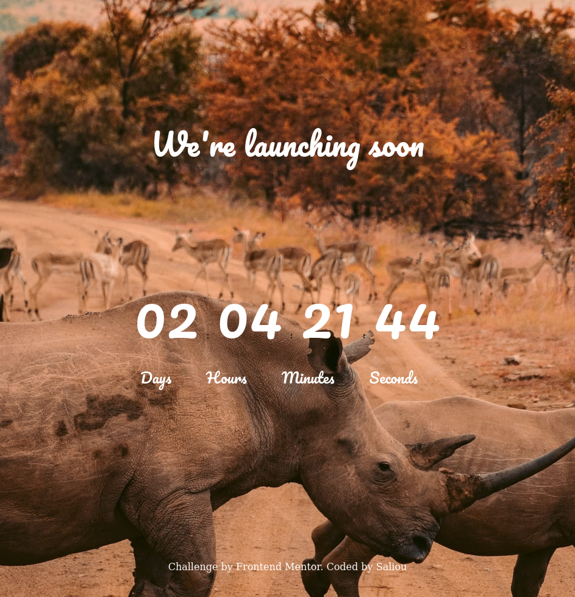

# Frontend Mentor - Launch countdown timer

## Welcome! 👋

- Live Site URL: [Here](  https://saliou1920.github.io/countdown-timer/)

## Table of contents 🙂

- [Overview](#overview)
  - [The challenge](#the-challenge)
  - [Screenshot](#screenshot)
  - [Links](#links)
  - [Built with](#built-with)
  - [Useful resources](#useful-resources)
- [Author](#author)

**Note: Delete this note and update the table of contents based on what sections you keep.**

## Overview

## The challenge 🔥

The challenge challenge is to build out this countdown timer.

Users should be able to: 

- View the optimal layout for the site depending on their device's screen size
- See hover states for all interactive elements on the page

### Screenshot (My Solution) 💻 

### Links

Others website that I build 👇

- Live Site URL: [Here]( https://saliou1920.github.io/Fylo-dark-theme-landing-page/)

- Countdown Timer : [Here]( https://saliou1920.github.io/countdown-timer/)

### Built with 🧰 

- Semantic HTML5 markup
- CSS custom properties
- Javascript

### Useful resources

- [MDN Web Docs](https://developer.mozilla.org/en-US/docs/Web/CSS/CSS_Grid_Layout/Basic_Concepts_of_Grid_Layout) 
- Background Photo by <a href="https://unsplash.com/@jamked?utm_source=unsplash&utm_medium=referral&utm_content=creditCopyText">Jamshed Khedri</a> on <a href="https://unsplash.com/s/photos/toronto-night?utm_source=unsplash&utm_medium=referral&utm_content=creditCopyText">Unsplash</a>
  

## Author 

- Linkedin - [@Saliou](https://www.linkedin.com/in/saliou-diop-527741112/)

